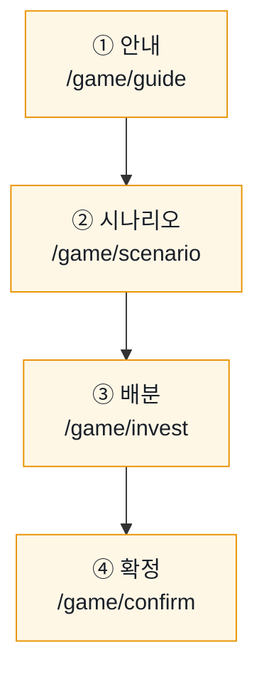
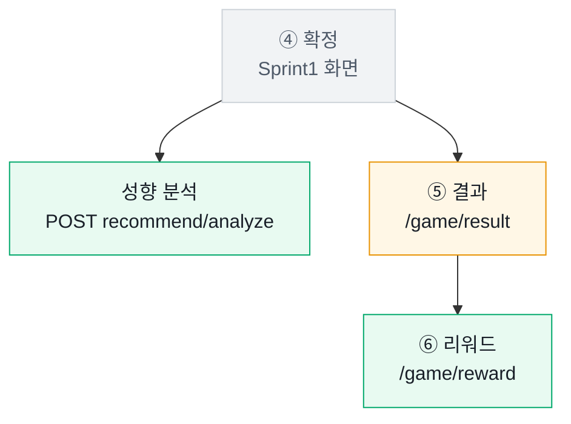
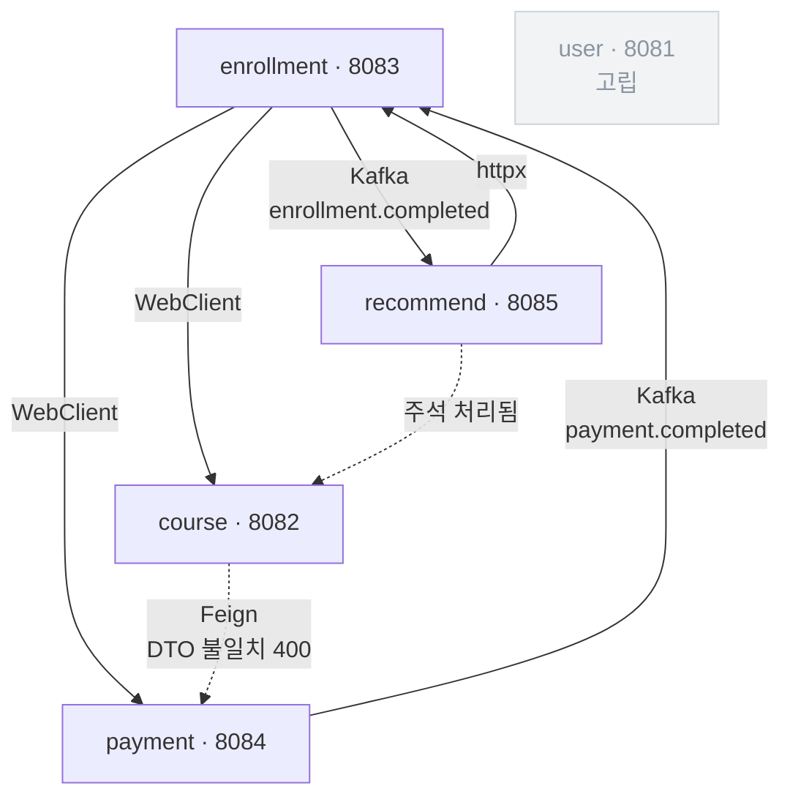

# 서비스 동작 흐름 — Sprint1 / Sprint2

기준 커밋: `0d4f998` (PR #8 머지 직후)
작성: 황재원(FE·AI) / 2026-08-27

스프린트별로 **무엇을 만들었고, 그중 무엇이 실제로 백엔드와 붙어 있는지**를 정리한다.
스프린트 리뷰에서 "이거 지금 되는 거예요?"에 답하기 위한 문서다.

| 배지 | 뜻 |
|---|---|
| ✅ | 백엔드가 있고 실제로 동작한다 |
| ⚠ | 엔드포인트는 있으나 필요한 것을 못 준다 |
| ❌ | 엔드포인트 자체가 없다 — 목으로만 돈다 |

**범위 규칙** (`CLAUDE.md`)

| | Sprint1 | Sprint2 |
|---|---|---|
| 손대는 곳 | `user` · `course` · `enrollment` · `vue-frontend` | `payment` · Kafka · `recommend` |
| 제약 | — | **Sprint1 서비스는 한 줄도 고치지 않는다** |

---

# Sprint1 — Walking Skeleton

## 목표

**백엔드 없이 게임 전 구간을 화면으로 완주한다.** 백엔드가 도착하지 않은 상태에서
동선·규칙·수집할 데이터를 먼저 확정하는 것이 목적이었다.

## 동선



네 화면 모두 **목 데이터로 동작한다.** 아래 경로는 전부 "제안"이고 백엔드에 없다.

| # | 화면 | 스토어 액션 | 프런트가 부르는 경로 | 백엔드 |
|---|---|---|---|---|
| ① | 안내 | `startGame` | `POST /api/enrollments/games` | ❌ 없음 |
| ② | 시나리오 | `loadScenario` | `GET /api/courses/scenarios/{id}` | ❌ 없음 |
| ③ | 배분 | `loadStocks` | `GET /api/courses/offered` | ❌ 없음 |
| ④ | 확정 | `submit` | `POST /api/enrollments` | ⚠ 있으나 필드 부족 |

> 새 prefix 를 만들 수 없다 — API Gateway 가 소스 없는 완성 이미지라
> `/api/{users,courses,enrollments,payments,recommend}` **5개 밖은 404** 다.
> 그래서 `/api/games/...` 대신 `/api/enrollments/games` 처럼 기존 prefix 아래로 밀어 넣었다.

## 단계별

**① 안내** — 규칙과 가상 투자금(1,000만원)을 보여 주고 참여 세션을 만든다.
목이 `participationId` 를 9001부터 발급한다. `participations` 테이블은 아직 없다.

**② 시나리오** — 상황·투자금·기간(3일)·목표를 제시한다.

**③ 배분** — 제시 종목에 **정수 주 단위**로 배분한다. 현금을 남기는 것도 유효한 선택이다.
전액 투자를 강제하면 안정 성향인 사람의 신호가 사라지기 때문이다.

이 화면에서 **성향 신호 7종이 수집되기 시작한다.**
그중 `changeCount`(배분을 바꾼 횟수)와 `decisionSeconds`(결정에 걸린 시간)는
**DB 로는 절대 복원할 수 없다** — 최종 선택만 저장되기 때문이다.
화면에서 관찰하지 않으면 영영 없는 데이터라 Sprint1 에 수집을 먼저 시작했다.

**④ 확정** — 주문을 확정한다. 호출이 성공하면 백엔드에서 이 사슬이 돈다:

```
enrollment  존재 확인(WebClient) → PENDING 저장 → payment 결제 요청(WebClient)
payment     ─Kafka payment.completed→  enrollment  : PENDING → ACTIVE
```

> ⚠ `EnrollRequest` 가 `courseId` 하나뿐이라 **종목별 배분 금액을 보낼 통로가 없다.**
> `EnrollmentService.enroll()` 의 결제 금액도 `BigDecimal.valueOf(99000)` 하드코딩이다.

## 이 시점의 백엔드

| 서비스 | 상태 |
|---|---|
| `user` · `course` · `enrollment` | 강사 템플릿 구조 그대로. 게임용 필드가 일부 추가됨 |
| Kafka `payment.completed` | 템플릿에 이미 있던 배선. 게임 문맥으로 재해석만 함 |

## 산출물

- 프런트 4화면 + 목 모드 전 구간 완주 (`VITE_USE_MOCK=true`)
- 게임 규칙 확정 — 현금 보유 허용, 종목 수 제한 없음, **목표 달성을 성공 조건으로 두지 않음**
- 성향 신호 7종 수집 시작
- OAuth2 코드를 지우지 않고 남겨 플래그 하나로 실 API 전환 가능

---

# Sprint2 — 결과 · 리워드 · AI 분석

## 목표

**게임이 끝난 뒤를 만든다.** Sprint1 은 확정에서 끝났다. 3일 뒤 결과와 참여 리워드,
그리고 행동 기반 성향 분석을 붙인다.

## 무엇이 더해졌나



> **성향 분석은 Sprint2 기능이지만 Sprint1 화면(④ 확정)에 얹혔다.**
> 확정 직후에 분석을 받아야 결과를 기다리는 동안 미리보기를 보여 줄 수 있기 때문이다.

| # | 화면 | 스토어 액션 | 프런트가 부르는 경로 | 백엔드 |
|---|---|---|---|---|
| ④ | 확정(기존) | `analyzeProfile` | `POST /api/recommend/analyze` | ✅ **완전 구현** |
| ⑤ | 결과(신규) | `loadGameResult` | `POST /api/courses/internal/result` | ⚠ 수치를 안 줌 |
| ⑥ | 리워드(신규) | `loadReward` | `GET /api/payments/internal/rewards/{id}` | ✅ 조회는 동작 |

## 단계별

**성향 분석 (④ 에 얹힘)** — 게임 API 중 **유일하게 온전히 동작한다.**

핵심: **손익을 입력으로 받지 않는다.** 배분 행동·현금 비중·변경 횟수·결정 시간만 본다.
수익이 난 사람을 무조건 좋은 투자자로 평가하지 않기 위한 의도된 설계다.

**⑤ 결과** — 3일 뒤 수익률·손익·종목별 결과. 예정일 전에는 D-day 대기 화면.

막힌 것 두 가지:
- **화면에 표시할 숫자가 없다.** 응답이 `"SUCCESS" | "FAILED"` 문자열뿐이다.
- **`quantity` 를 무시한다.** `Σ(tempPrice − price)` 만 더해 1주와 1000주가 같은 취급이다.

**⑥ 리워드** — 지급 포인트, 3일 재투자 진행, 출금 가능 전환.

> ⚠ 조회는 되지만 **생성이 막혀 있다.** `course → payment` 호출이 DTO 불일치로 400 이라
> 리워드가 한 건도 만들어지지 않는다.

리워드 금액은 결과의 수익률에서 파생된다. 그래서 결과를 다시 받으면 프런트가 리워드를 비운다 —
안 그러면 손실 화면인데 이전 지급액이 남는다.

## 신규 백엔드

| 서비스 | 무엇이 새로 생겼나 | 상태 |
|---|---|---|
| `recommend` | `POST /api/recommend/analyze` — 성향 분석, 규칙 기반 완전 구현 | ✅ |
| `payment` | `POST/GET internal/rewards` — 리워드 생성·조회, 3일 재투자 | ✅ 조회만 |
| `course` | `POST internal/result` — 수익 판정 | ⚠ |
| Kafka | `enrollment.completed` → recommend consumer (현재는 로그만) | ✅ |

## 산출물

- 프런트 2화면 신규 (결과 · 리워드) + 확정 화면에 성향 분석
- 리워드 정책 확정 — 수익 > 0 → 10,000P / 그 외 → 5,000P, 지급 후 3일 재투자
- 목 응답 필드를 `PaymentDto.RewardResponse` 와 1:1로 맞춤 → 플래그만 바꾸면 붙는다
- 발표용 도구 2개 (아래 참고)

---

# 최종 상태 — 전체 서비스 연결

두 스프린트를 합친 지금의 배선이다.



점선 = 끊긴 연결. `user` 는 어느 서비스도 호출하지 않는다.

### 동기 호출

| 부르는 쪽 | 방식 | 대상 | 스프린트 | 상태 |
|---|---|---|---|---|
| enrollment | WebClient | course `internal/exists` · `{id}` · `enrollment-count` | 1 | ✅ |
| enrollment | WebClient | payment `internal/request` | 1 | ✅ 금액 하드코딩 |
| course | Feign | payment `internal/rewards` | 2 | ❌ 400 |
| recommend | httpx | enrollment `internal/history/{userId}` | 2 | ✅ |
| recommend | httpx | course `internal/recommend` | 2 | ❌ 주석 처리 |

### Kafka

| 토픽 | Producer | Consumer | 하는 일 | 스프린트 |
|---|---|---|---|---|
| `payment.completed` | payment | enrollment | PENDING → ACTIVE | 1 (템플릿) |
| `enrollment.completed` | enrollment | recommend | 현재는 로그만 | 2 |

> Consumer 가 타입 헤더 없이 `Map<String, Object>` 로 받는다.
> **필드 추가는 안전하지만 이름 변경은 조용히 깨진다.**

### 인증 — 두 갈래

- **Java 서비스**: 게이트웨이가 주입한 `X-User-Id` 헤더를 받는다. JWT 를 직접 파싱하지 않는다.
- **recommend-service**: 예외적으로 **JWKS 로 Bearer 토큰을 직접 검증**한다.

---

# 지금 막힌 곳

상세 원인과 요청 내용은 [`SPRINT2_BE_REQUESTS.md`](./SPRINT2_BE_REQUESTS.md) 에 있다.
여기서는 어느 단계가 막히는지만 적는다.

| # | 막힌 것 | 영향 | 스프린트 | 문서 |
|---|---|---|---|---|
| 1 | `course → payment` 리워드 호출 400 | ⑥ 리워드 — **한 건도 생성 안 됨** | 2 | §1 |
| 2 | 수익 판정이 `quantity` 무시 · 수치 미반환 | ⑤ 결과 — 표시할 숫자가 없음 | 2 | §2 |
| 3 | `EnrollRequest` 에 투자 필드 부재 | ④ 확정 — 배분을 보낼 통로 없음 | 1 | §3 |
| 4 | 게임 시작·시나리오·종목 경로 부재 | ①②③ — 목으로만 동작 | 1 | §3 참고 |

> ⚠ **3번은 범위 규칙과 충돌한다.** `EnrollRequest` 수정은 Sprint1 서비스를 고치는 일이라
> "Sprint2 는 Sprint1 서비스를 한 줄도 고치지 않는다"와 정면으로 부딪친다. 팀 결정이 필요하다.

추가로 recommend 의 카테고리 enum 이 구 강의 축이라 `GET /api/recommend/{user_id}` 가 500 이다.

---

# 목 모드가 대신하는 것

`vue-frontend/.env` 의 `VITE_USE_MOCK=true` 일 때 `src/mock/` 이 백엔드를 대신한다.
`src/config.js` 가 유일한 판정 지점이고 모든 `src/api/*.js` 가 거기서 읽는다.

| 목 파일 | 대신하는 것 | 스프린트 |
|---|---|---|
| `mock/participation.js` | 게임 참여 세션 | 1 |
| `mock/scenario.js` | 시나리오 + 리워드 정책 + 게임 규칙 | 1 |
| `mock/stocks.js` | 제시 종목 — **DB 시드와 1:1** | 1 |
| `store/auth.js` 의 `MOCK_USER` | 로그인 | 1 |
| `mock/investmentProfile.js` | 성향 분석 — FastAPI 와 같은 점수식 | 2 |
| `mock/gameResult.js` | 3일 뒤 결과 (`RESULT_PRICES` = 시드의 `temp_price`) | 2 |
| `mock/reward.js` | 리워드 — `PaymentDto.RewardResponse` 와 같은 필드 | 2 |

## 발표용 도구 2개

**좌측 하단 MOCK / LIVE 토글** — `.env` 를 고치고 재시작하지 않고 그 자리에서 전환한다.
localStorage 오버라이드가 환경변수를 이기고 `기본값으로` 로 되돌린다.
바꾸면 새로고침한다 — `USE_MOCK` 은 모듈 로드 시 정해지는 상수이고
스토어에 이전 모드의 데이터가 남기 때문이다.

> LIVE 로 바꾸면 api-gateway(8080)와 auth-server(9000)가 떠 있어야 한다.
> 둘 다 소스가 없고 `infra-images.tar` 는 리포에 없다 — 슬랙에서 받아 `docker load` 한다.

**결과 화면의 시나리오 칩** — `실제 / 수익 / 손실 / 0%`.
결과는 사용자의 실제 배분으로 계산되므로 손실 화면을 보려면 하락 종목에 몰아넣는 조합을
미리 알아야 했다. 배분과 무관하게 원하는 화면을 바로 볼 수 있다. **목 모드에서만 보인다.**

---

# 확인 방법

```bash
cd vue-frontend && npm install && npm run dev   # http://localhost:3000
```

로그인 → 게임 시작 → 배분 → 확정 → 결과 확인하러 가기 → `데모: 미리 보기` → 리워드 확인하기

백엔드까지 띄우려면 루트에서 `docker compose up -d`.
스키마를 고쳤으면 `docker compose down -v` 로 볼륨을 지워야 `init-db` 가 다시 돈다.
