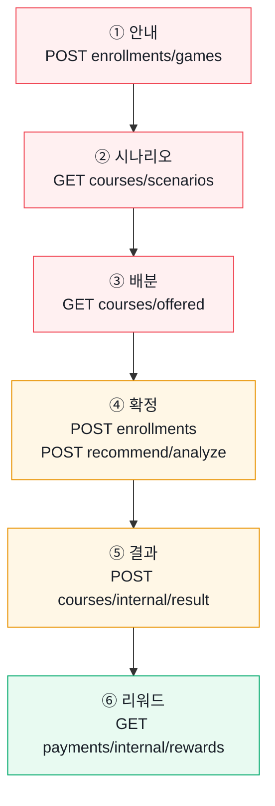
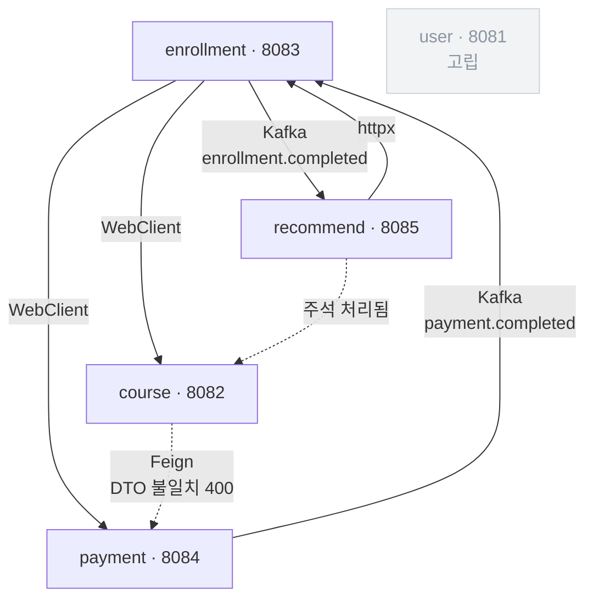

# 서비스 동작 흐름 — Sprint1 + Sprint2

기준 커밋: `0d4f998` (PR #8 머지 직후)
작성: 황재원(FE·AI) / 2026-08-27

게임 전 구간이 화면으로는 완성됐다. 이 문서는 **각 단계가 실제로 백엔드와 붙어 있는지,
아니면 목이 대신하고 있는지**를 한 곳에 모은다. "이거 지금 되나요?"에 답하기 위한 문서다.

| 배지 | 뜻 |
|---|---|
| ✅ | 백엔드가 있고 실제로 동작한다 |
| ⚠ | 엔드포인트는 있으나 필요한 것을 못 준다 |
| ❌ | 엔드포인트 자체가 없다 — 목으로만 돈다 |

---

## 1. 한눈에 보기

### 사용자 동선과 각 단계가 부르는 API



빨강 = 백엔드 없음(목으로만) · 주황 = 있으나 부족 · 초록 = 동작.
①②③ 이 전부 빨강인 것이 지금의 핵심이다 — 게임 진입 구간이 통째로 목이다.

### 백엔드 서비스 간 연결



점선 = 끊긴 연결. `user` 는 어느 서비스도 호출하지 않는다.

---

## 2. 단계별 상세

### ① 안내 — `/game/guide` · Sprint1

게임 규칙과 가상 투자금을 보여 주고, 시작을 누르면 참여 세션을 만든다.

| | |
|---|---|
| 스토어 | `game.startGame(scenarioId)` |
| 프런트 호출 | `POST /api/enrollments/games` |
| 백엔드 | ❌ **없음.** `EnrollmentController` 에 해당 매핑이 없다 |
| 목이 하는 일 | `createMockParticipation()` 이 `participationId` 를 9001부터 발급 |

> `participations` 테이블 자체가 아직 없다. `participationId` 는 recommend 의 **요청 DTO 안에만**
> 존재하고 DB 어디에도 저장되지 않는다.

### ② 시나리오 — `/game/scenario` · Sprint1

상황·투자금·기간·목표를 제시한다.

| | |
|---|---|
| 스토어 | `game.loadScenario(id)` |
| 프런트 호출 | `GET /api/courses/scenarios/{id}` |
| 백엔드 | ❌ **없음** |
| 목이 하는 일 | `MOCK_SCENARIO` — 1,000만원 / 3일 |

### ③ 배분 — `/game/invest` · Sprint1

제시 종목에 정수 주 단위로 배분한다. 현금을 남기는 것도 유효한 선택이다.

| | |
|---|---|
| 스토어 | `game.loadStocks()` |
| 프런트 호출 | `GET /api/courses/offered?participationId=` |
| 백엔드 | ❌ **없음.** 다만 `GET /api/courses` 가 있어 대체 가능하다 |
| 목이 하는 일 | `MOCK_STOCKS` — **DB 시드(`init-db/02_seed_courses.sql`)와 1:1** |

> 목 종목은 시드와 종목명·업종·기준가·결과가가 같다. 실 API 로 넘겨도 화면의 종목이 바뀌지 않는다.
> 종목 코드는 `code` 로 따로 보관하고 **화면에 렌더하지 않는다**(정책상 표시 금지).

이 화면에서 **성향 신호가 수집된다.** 배분을 바꾼 횟수·결정에 걸린 시간은
최종 상태만 저장하는 DB 로는 복원할 수 없어, 화면에서 관찰하지 않으면 영영 없는 데이터다.

### ④ 확정 — `/game/confirm` · Sprint1 (+ 분석은 Sprint2)

주문을 확정하고, 이어서 행동 기반 성향 분석을 받는다.

| | |
|---|---|
| 스토어 | `game.submit()` → 내부에서 `analyzeProfile()` |
| 프런트 호출 A | `POST /api/enrollments` |
| 백엔드 A | ⚠ **있으나 `EnrollRequest` 가 `courseId` 하나뿐**이라 배분 금액을 보낼 통로가 없다 |
| 프런트 호출 B | `POST /api/recommend/analyze` |
| 백엔드 B | ✅ **완전 구현.** 게임 API 중 유일하게 온전하다 |

호출 A 가 성공하면 백엔드에서 이 사슬이 돈다:

```
enrollment  존재 확인(WebClient) → PENDING 저장 → payment 결제 요청(WebClient)
payment     ─Kafka payment.completed→  enrollment  : PENDING → ACTIVE
enrollment  ─Kafka enrollment.completed→ recommend : 현재는 로그만 남긴다
```

> ⚠ `EnrollmentService.enroll()` 의 결제 금액이 `BigDecimal.valueOf(99000)` **하드코딩**이다.
> 종목 가격도 사용자 투자금액도 아니다.

성향 분석(B)은 **손익을 입력으로 받지 않는다.** 배분 행동·현금 비중·변경 횟수·결정 시간만 본다.
의도된 설계다 — 수익이 난 사람을 무조건 좋은 투자자로 평가하지 않기 위해서다.

### ⑤ 결과 — `/game/result` · **Sprint2 신규**

3일 뒤 수익률·손익·종목별 결과를 공개한다. 예정일 전에는 D-day 대기 화면.

| | |
|---|---|
| 스토어 | `game.loadGameResult({ reveal, outcome })` |
| 프런트 호출 | `POST /api/courses/internal/result` |
| 백엔드 | ⚠ **있으나 `"SUCCESS" \| "FAILED"` 문자열만** 돌려준다 |
| 목이 하는 일 | `RESULT_PRICES`(시드의 `temp_price`)로 수익률·손익·종목별 결과를 계산 |

막힌 것 두 가지:
- **화면에 표시할 숫자가 없다.** 수익률도 수익금액도 응답에 없다.
- **`quantity` 를 무시한다.** `Σ(tempPrice − price)` 만 더해서 1주와 1000주가 같은 취급이다.

### ⑥ 리워드 — `/game/reward` · **Sprint2 신규**

지급 포인트, 3일 재투자 진행, 출금 가능 전환을 보여 준다.

| | |
|---|---|
| 스토어 | `game.loadReward()` |
| 프런트 호출 | `GET /api/payments/internal/rewards/{paymentId}` |
| 백엔드 | ✅ **구현돼 있고 응답 필드도 목과 1:1** |
| 목이 하는 일 | `createMockReward()` — `PaymentDto.RewardResponse` 와 같은 필드 |

> ⚠ 조회는 되지만 **생성이 막혀 있다.** `course → payment` 리워드 호출이 DTO 불일치로 400 이라
> 리워드가 한 건도 만들어지지 않는다. 1번만 고쳐지면 이 경로는 바로 쓸 수 있다.

리워드 금액은 결과의 수익률에서 파생된다. 그래서 결과를 다시 받으면 프런트가 리워드를 비운다 —
안 그러면 손실 화면인데 이전 지급액이 남는다.

---

## 3. 서비스 간 연결 지도

### 동기 호출

| 부르는 쪽 | 방식 | 대상 | 상태 |
|---|---|---|---|
| enrollment | WebClient | course `internal/exists` · `internal/{id}` · `enrollment-count` | ✅ |
| enrollment | WebClient | payment `internal/request` | ✅ 금액 하드코딩 |
| course | Feign | payment `internal/rewards` | ❌ DTO 불일치 400 |
| recommend | httpx | enrollment `internal/history/{userId}` | ✅ |
| recommend | httpx | course `internal/recommend` | ❌ 주석 처리돼 404 |
| user | — | 아무도 부르지 않는다 | 고립 |

### Kafka

| 토픽 | Producer | Consumer | 하는 일 | 상태 |
|---|---|---|---|---|
| `payment.completed` | payment | enrollment | PENDING → ACTIVE 전환 | ✅ |
| `enrollment.completed` | enrollment | recommend | 현재는 로그만 (캐시 갱신 TODO) | ✅ |

> Consumer 가 타입 헤더 없이 `Map<String, Object>` 로 받는다.
> **필드 추가는 안전하지만 이름 변경은 조용히 깨진다.**

### recommend 전체 경로

| 메서드 | 경로 | 인증 | 상태 |
|---|---|---|---|
| GET | `/api/recommend/health` | 없음 | ✅ |
| POST | `/api/recommend/analyze` | Bearer JWT | ✅ |
| GET | `/api/recommend/{user_id}` | Bearer JWT | ❌ 500 (카테고리 enum 불일치) |

> recommend-service 만 예외적으로 **JWKS 로 Bearer 토큰을 직접 검증**한다.
> 나머지 Java 서비스는 게이트웨이가 주입한 `X-User-Id` 헤더를 받는다.

---

## 4. Sprint1 / Sprint2 경계

| | Sprint1 | Sprint2 |
|---|---|---|
| 범위 | `user` · `course` · `enrollment` · `vue-frontend` | `payment` · Kafka · `recommend` |
| 화면 | ① 안내 ~ ④ 확정 | ⑤ 결과 · ⑥ 리워드 |
| 규칙 | — | **Sprint1 서비스는 한 줄도 고치지 않는다** |

> ⚠ 이 규칙과 충돌하는 요구가 하나 있다 — `EnrollRequest` 필드 추가는
> Sprint1 서비스(`enrollment`) 수정이다. 팀 결정이 필요하다.

Kafka 규칙: **토픽 이름과 Producer/Consumer 구조는 유지하고 payload 필드만 확장한다.**

경로 제약: API Gateway 가 소스 없는 완성 이미지라 라우트를 추가할 수 없다.
`/api/{users,courses,enrollments,payments,recommend}` **5개 prefix 밖은 404** 다.
새 경로가 필요하면 `/api/enrollments/games` 처럼 기존 prefix 아래로 밀어 넣는다.

---

## 5. 지금 막힌 곳

상세 원인과 요청 내용은 [`SPRINT2_BE_REQUESTS.md`](./SPRINT2_BE_REQUESTS.md) 에 있다.
여기서는 어느 단계가 막히는지만 적는다.

| # | 막힌 것 | 영향받는 단계 | 문서 |
|---|---|---|---|
| 1 | `course → payment` 리워드 호출 400 | ⑥ 리워드 — **한 건도 생성 안 됨** | §1 |
| 2 | 수익 판정이 `quantity` 무시 · 수치 미반환 | ⑤ 결과 — 표시할 숫자가 없음 | §2 |
| 3 | `EnrollRequest` 에 투자 필드 부재 | ④ 확정 — 배분을 보낼 통로 없음 | §3 |
| 4 | 게임 시작·시나리오·종목 경로 부재 | ①②③ — 목으로만 동작 | §3 참고 |

추가로 recommend 의 카테고리 enum 이 구 강의 축이라 `GET /api/recommend/{user_id}` 가 500 이다.

---

## 6. 목 모드가 대신하는 것

`vue-frontend/.env` 의 `VITE_USE_MOCK=true` 일 때 `src/mock/` 이 백엔드를 대신한다.
`src/config.js` 가 유일한 판정 지점이고, 모든 `src/api/*.js` 가 거기서 읽는다.

| 목 파일 | 대신하는 것 |
|---|---|
| `mock/participation.js` | 게임 참여 세션 (`participationId` 발급) |
| `mock/scenario.js` | 시나리오 + 리워드 정책 + 게임 규칙 |
| `mock/stocks.js` | 제시 종목 — **DB 시드와 1:1** |
| `mock/gameResult.js` | 3일 뒤 결과 (`RESULT_PRICES` = 시드의 `temp_price`) |
| `mock/reward.js` | 리워드 상태 — `PaymentDto.RewardResponse` 와 같은 필드 |
| `mock/investmentProfile.js` | 성향 분석 — FastAPI 와 같은 점수식 |
| `store/auth.js` 의 `MOCK_USER` | 로그인 |

### 발표용 도구 2개

**좌측 하단 MOCK / LIVE 토글** — `.env` 를 고치고 재시작하지 않고 그 자리에서 전환한다.
localStorage 오버라이드가 환경변수를 이기고, `기본값으로` 로 되돌린다.
바꾸면 새로고침한다 — `USE_MOCK` 은 모듈 로드 시 정해지는 상수이고
스토어에 이전 모드의 데이터가 남기 때문이다.

> LIVE 로 바꾸면 api-gateway(8080)와 auth-server(9000)가 떠 있어야 한다.
> 둘 다 소스가 없고 `infra-images.tar` 는 리포에 없다 — 슬랙에서 받아 `docker load` 한다.

**결과 화면의 시나리오 칩** — `실제 / 수익 / 손실 / 0%`.
결과는 사용자의 실제 배분으로 계산되므로 손실 화면을 보려면 하락 종목에 몰아넣는 조합을
미리 알아야 했다. 배분과 무관하게 원하는 화면을 바로 볼 수 있다. **목 모드에서만 보인다.**

---

## 확인 방법

```bash
cd vue-frontend && npm install && npm run dev   # http://localhost:3000
```

로그인 → 게임 시작 → 배분 → 확정 → 결과 확인하러 가기 → `데모: 미리 보기` → 리워드 확인하기

백엔드까지 띄우려면 루트에서 `docker compose up -d`.
스키마를 고쳤으면 `docker compose down -v` 로 볼륨을 지워야 `init-db` 가 다시 돈다.
