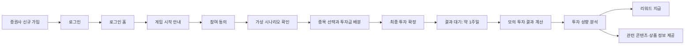
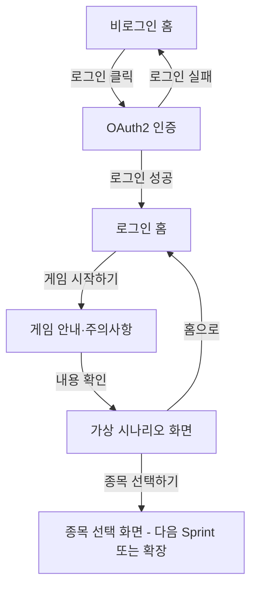

# 증권사 주식투자 성향 파악 게임 기획 초안

> 문서 상태: 팀 논의용 초안  
> 작성 기준: Sprint 1 프런트엔드 범위 우선  
> 프로젝트 성격: 증권사 신규 고객 온보딩용 모의 투자 게임

> **Sprint 2 확정 정책(2026-08-27)**: 가상 투자금은 1천만원, 결과 산정 기간은 3일이다.
> 수익 시 10,000P, 손실 또는 0% 시 5,000P를 지급하며, 포인트는 3일간 재투자 후
> 출금할 수 있다. 종목 위험도는 분석 입력으로만 사용하고 프론트에는 노출하지 않는다.
> 주문은 정수 주 단위로만 받고, 종목 코드는 사용하지 않는다.
> 아래 Sprint 1 초안의 1만원·일주일 표현보다 이 정책을 우선한다.

---

## 1. 프로젝트 한 줄 정의

증권사 신규 가입자가 가상의 상황과 자금으로 모의 주식투자를 진행하면, 일정 기간 후 투자 결과와 리워드, 행동 기반 투자 성향 분석 및 관련 투자상품 정보를 제공하는 게임형 온보딩 서비스다.

### 임시 프로젝트명

- 한글명: 투자 성향 탐험 게임
- 영문명 후보: InvestQuest
- 한 줄 문구: 게임으로 시작하는 나의 첫 투자 성향 분석

프로젝트명은 아직 확정하지 않고 이후 팀 회의에서 변경할 수 있다.

---

## 2. 기획 배경과 문제 정의

### 2.1 사용자 관점의 문제

증권사에 처음 가입한 사용자는 다음과 같은 어려움을 겪을 수 있다.

- 자신의 투자 성향을 정확히 알기 어렵다.
- 일반적인 투자 성향 설문은 질문이 추상적이고 재미가 부족하다.
- 주식 경험이 적으면 실제 상황에서 어떤 선택을 할지 스스로 판단하기 어렵다.
- 증권사가 제시하는 상품이 왜 자신에게 적합한지 이해하기 어렵다.
- 신규 가입 후 서비스를 계속 이용할 동기가 부족할 수 있다.

### 2.2 증권사 관점의 문제

- 신규 가입자가 계좌만 개설한 뒤 실제 서비스 이용으로 이어지지 않을 수 있다.
- 단순 설문만으로는 고객의 실제 투자 행동을 충분히 이해하기 어렵다.
- 고객에게 어떤 콘텐츠나 상품 정보를 먼저 제시해야 할지 판단하기 어렵다.
- 신규 고객과 지속적으로 상호작용할 수 있는 온보딩 장치가 부족하다.

### 2.3 해결 아이디어

질문에 답하는 설문 대신 사용자가 가상의 위기 상황에서 제한된 자금을 직접 배분하고 투자하도록 한다. 이 과정에서 선택 종목, 투자 비율, 현금 보유량, 선택 변경 횟수, 위험 감수 정도 등의 행동 데이터를 수집한다.

게임 종료 후 일정 기간 동안의 모의 투자 결과를 계산하여 다음 정보를 제공한다.

- 모의 투자 수익률과 결과
- 사용자의 투자 의사결정 특징
- 행동 기반 투자 성향 분석
- 성향에 맞는 학습 콘텐츠 또는 투자상품 정보
- 게임 참여 리워드

---

## 3. 프로젝트 목표

### 사용자에게 제공하는 가치

1. 어려운 투자 개념을 게임을 통해 쉽게 경험한다.
2. 자신의 투자 선택과 그 결과를 확인한다.
3. 단순 설문과 다른 행동 기반 성향 분석을 받는다.
4. 자신의 선택에 대한 설명과 투자 학습 방향을 얻는다.
5. 게임 참여 리워드를 받아 서비스 재방문 동기를 얻는다.

### 증권사에 제공하는 가치

1. 게임형 온보딩을 통해 신규 고객의 초기 참여율을 높인다.
2. 고객이 실제로 선택한 행동 데이터를 확보한다.
3. 고객별 관심 종목, 위험 선호도, 분산투자 경향 등을 이해한다.
4. 고객 세그먼트별 콘텐츠와 상품 정보 제공 기회를 만든다.
5. 결과와 리워드를 일주일 뒤 제공하여 재방문을 유도한다.

### 핵심 차별점

일반적인 투자 성향 서비스가 설문 답변만 분석한다면, 이 프로젝트는 가상의 시나리오 안에서 사용자가 실제로 내린 투자 결정을 분석한다.

단, 게임 분석은 법적·제도적인 투자자 정보 확인 절차를 대체하는 것이 아니라 고객 이해를 돕는 보조 데이터로 사용한다. 실제 상품 권유 단계에서는 증권사의 적합성·적정성 확인 절차와 위험 고지가 별도로 필요하다.

---

## 4. 주요 이해관계자

| 이해관계자 | 원하는 가치 | 서비스가 제공할 내용 |
|---|---|---|
| 신규 가입 사용자 | 재미있는 투자 경험, 리워드, 자기 이해 | 모의 투자 게임, 결과, 성향 분석, 리워드 |
| 투자 초보 사용자 | 쉬운 설명과 학습 방향 | 선택 결과 해설, 위험 안내, 관련 콘텐츠 |
| 증권사 마케팅 담당자 | 신규 고객 활성화와 재방문 | 게임 참여율, 완료율, 리워드 재방문 흐름 |
| 증권사 상품 담당자 | 고객 관심과 성향 데이터 | 고객군별 행동 데이터와 상품 관심 지표 |
| 증권사 준법·보안 담당자 | 오인 방지, 개인정보 보호 | 동의, 고지, 분석 근거, 데이터 보호 정책 |

---

## 5. 전체 사용자 시나리오

### 대표 사용자

- 이름: 김투자
- 상황: 증권사에 처음 가입한 투자 초보자
- 목표: 리워드를 받고 자신의 투자 성향도 알아보고 싶다.
- 어려움: 어떤 종목을 어떤 비율로 사야 하는지 경험이 없다.

### 대표 게임 시나리오 예시

> 현재 갚아야 할 빚이 30,000원 있습니다.  
> 지금 사용할 수 있는 투자금은 10,000원입니다.  
> 일주일 동안 투자하여 자금을 늘려야 합니다.  
> 제시된 종목과 현금 중 원하는 방식으로 투자금을 배분해 보세요.

이 문구는 게임의 몰입을 위한 예시이며, 팀 논의 후 과도한 불안이나 무리한 투자를 조장하지 않는 표현으로 다듬어야 한다.

### 전체 서비스 흐름



### 단계별 설명

| 단계 | 사용자 행동 | 시스템 처리 | 사용자에게 보이는 결과 |
|---|---|---|---|
| 1. 로그인 | 계정으로 로그인한다. | 인증하고 사용자 정보를 조회한다. | 비로그인 홈에서 로그인 홈으로 이동 |
| 2. 게임 안내 | 게임 시작 버튼을 누른다. | 참여 가능 여부를 확인한다. | 게임 목적, 기간, 리워드 안내 |
| 3. 시나리오 확인 | 가상 상황을 읽는다. | 시나리오와 가상 투자금을 제공한다. | 상황, 목표, 제한 조건 표시 |
| 4. 투자 선택 | 종목과 투자 금액을 선택한다. | 선택 내역과 잔여 금액을 계산한다. | 포트폴리오와 예상 위험 표시 |
| 5. 투자 확정 | 최종 선택을 제출한다. | 투자 기록을 저장하고 대기 상태로 변경한다. | 제출 완료와 결과 예정일 안내 |
| 6. 결과 대기 | 일주일 후 다시 방문한다. | 기준 가격과 결과 가격으로 수익률을 계산한다. | 결과 확인 알림 또는 홈 배너 |
| 7. 결과 확인 | 투자 결과를 확인한다. | 행동 데이터와 결과를 분석한다. | 수익률, 선택 해설, 성향 분석 |
| 8. 리워드·정보 | 리워드를 받고 추천을 확인한다. | 참여 조건을 확인하고 지급한다. | 리워드와 관련 콘텐츠·상품 정보 |

---

## 6. 기존 MSA 템플릿 도메인 매핑

기존 교육 플랫폼의 기술 흐름은 유지하고 업무 용어를 투자 게임 도메인으로 변경한다.

| 기존 템플릿 | 신규 도메인 | 주요 책임 |
|---|---|---|
| `user-service` | 사용자 관리 | 신규 가입 사용자, 프로필, 게임 참여 정보 관리 |
| `course-service` | 주식·시나리오 관리 | 게임 종목, 종목 정보, 가상 시나리오 조회 |
| `enrollment-service` | 모의 투자 관리 | 사용자의 종목 선택, 투자금 배분, 투자 상태 관리 |
| `payment-service` | 리워드 관리 | 게임 완료 조건 확인, 모의 리워드 지급 상태 관리 |
| `recommend-service` | 투자 성향·추천 | 행동 데이터 분석, 성향 결과, 관련 콘텐츠·상품 정보 제공 |
| Auth Server | 인증 서버 | 로그인과 Access Token 발급 |
| API Gateway | API 진입점 | 인증 확인과 각 마이크로서비스로 요청 전달 |
| Eureka | 서비스 디스커버리 | 서비스 등록과 위치 탐색 |
| Kafka | 비동기 이벤트 전달 | 투자 확정, 결과 계산 완료, 리워드 지급 이벤트 전달 |

### 핵심 객체 매핑

| 기존 객체 | 신규 객체 | 설명 |
|---|---|---|
| User | User | 증권사 신규 가입 사용자 |
| Course | Stock 또는 GameScenario | 게임에서 선택할 주식 종목 또는 가상 상황 |
| Enrollment | Investment | 사용자의 모의 투자 신청과 선택 내역 |
| Payment | Reward | 게임 결과 확인 후 지급할 리워드 |
| Recommendation | InvestmentProfileRecommendation | 투자 성향 결과와 관련 정보 |

### 상태 매핑 초안

| 투자 상태 | 의미 |
|---|---|
| `READY` | 게임을 시작했지만 아직 투자를 확정하지 않음 |
| `SUBMITTED` | 투자 선택을 최종 제출함 |
| `IN_PROGRESS` | 결과 산정 기간이 진행 중임 |
| `COMPLETED` | 모의 투자 결과 계산이 완료됨 |
| `REWARDED` | 사용자가 결과를 확인하고 리워드를 받음 |

Sprint 1에서는 상태를 모두 구현하지 않고 `READY` 또는 시나리오 진입 단계까지만 화면으로 확인한다.

---

## 7. 투자 성향 분석 아이디어

게임에서 다음 행동을 분석 후보로 활용할 수 있다.

| 행동 데이터 | 해석 가능한 특징 예시 |
|---|---|
| 고변동성 종목 투자 비중 | 위험 감수 경향 |
| 현금 보유 비중 | 안정성 선호 경향 |
| 한 종목 집중 비율 | 집중투자 또는 분산투자 경향 |
| 종목 선택 개수 | 분산 수준 |
| 선택 변경 횟수 | 신중함 또는 판단 변동성 |
| 의사결정에 걸린 시간 | 즉흥적·숙고형 의사결정 경향 |
| 손실 가능성 안내 후 선택 변화 | 손실 회피 경향 |
| 업종 선택 비중 | 관심 산업과 테마 |

### 성향 결과 예시

- 안정 추구형
- 균형 투자형
- 성장 추구형
- 적극 투자형

이 유형은 현재 아이디어 수준이며 Sprint 2에서 팀이 분석 기준과 점수 계산 방식을 합의해야 한다. 수익이 많이 난 사용자를 무조건 좋은 투자자로 평가해서는 안 되며, 결과뿐 아니라 선택 과정과 위험 수준을 함께 분석해야 한다.

---

## 8. 팀 구성과 역할

| 역할 | 인원 | 주요 책임 |
|---|---:|---|
| PO | 1명 | 문제 정의, 우선순위, 요구사항, 일정, 발표 흐름 관리 |
| FE + AI | 2명 | Vue 화면 구현, API 연동, 사용자 행동 데이터 정의, AI 분석 화면 및 로직 협업 |
| BE | 3명 | 사용자·주식·투자·리워드 서비스, DB, API, Kafka 이벤트 구현 |

### FE + AI 역할의 권장 세분화

두 사람이 완전히 분리하기보다 화면과 AI 데이터 계약을 함께 이해하되 주 담당을 정한다.

| 구분 | FE + AI 담당 A | FE + AI 담당 B |
|---|---|---|
| Sprint 1 주 담당 | 홈·로그인 상태·게임 시작 흐름 | 시나리오·투자 게임 화면 |
| 공통 작업 | 공통 컴포넌트와 디자인 규칙 | 상태 관리와 API 응답 연결 |
| Sprint 2 주 담당 | 결과·리워드·추천 화면 | 성향 분석 기준과 AI 응답 연결 |
| 협업 항목 | 사용자 행동 이벤트 정의 | AI 입력 데이터와 출력 형식 정의 |

정확한 담당 화면은 팀 회의에서 파일 단위로 확정한다.

---

## 9. Sprint 1 목표

### Sprint 1 한 줄 목표

사용자가 로그인 상태를 확인하고 게임 시작 안내를 거쳐 가상 투자 시나리오 화면까지 진입할 수 있는 프런트엔드 Walking Skeleton을 완성한다.

### Sprint 1 프런트엔드 범위

1. 홈 화면 만들기와 로그인 상태 표시
2. 로그인 홈에서 게임 시작 버튼과 리워드 안내 표시
3. 게임 시작 후 가상 시나리오 화면 표시

### 이번 Sprint에서 하지 않는 것

- 실제 종목 가격 연동
- 완성된 투자금 배분 로직
- 일주일 뒤 수익률 계산
- 투자 성향 AI 분석
- 실제 금융상품 추천
- 실제 금전성 리워드 지급
- Kafka 기반 결과 완료 이벤트 전체 구현

이번 Sprint의 핵심은 모든 기능을 얕게 만드는 것이 아니라, 사용자가 홈에서 시나리오까지 실제로 이동할 수 있는 하나의 흐름을 완성하는 것이다.

---

## 10. Sprint 1 화면 기획

### 화면 1. 비로그인 홈

#### 목적

서비스의 핵심 가치를 짧게 전달하고 사용자가 로그인하도록 유도한다.

#### 주요 구성

- 서비스 로고와 임시 서비스명
- 메인 문구: 게임으로 알아보는 나의 투자 성향
- 보조 문구: 가상 투자 게임에 참여하고 일주일 뒤 결과와 리워드를 확인하세요.
- 로그인 버튼
- 게임 방식 3단계 소개
  1. 가상 상황 확인
  2. 종목 선택과 모의 투자
  3. 결과·성향·리워드 확인
- 모의 투자이며 실제 투자 수익을 보장하지 않는다는 안내

#### 사용자 액션

- 로그인 버튼 클릭
- OAuth2 인증 화면으로 이동

---

### 화면 2. 로그인 홈

#### 목적

로그인 사용자가 게임의 혜택과 진행 방식을 이해하고 게임을 시작하게 한다.

#### 주요 구성

- 사용자 이름 또는 환영 문구
- 게임 시작하기 버튼
- 현재 게임 참여 상태
  - 참여 전
  - 진행 중
  - 결과 대기
  - 결과 확인 가능
- 핵심 안내사항
  - 게임은 가상의 투자금으로 진행됩니다.
  - 투자 결과는 약 일주일 뒤 확인할 수 있습니다.
  - 결과 확인 시 참여 리워드가 지급됩니다.
  - 게임 결과는 실제 수익을 보장하지 않습니다.

#### 기본 버튼 문구

| 사용자 상태 | 버튼 문구 | 이동 화면 |
|---|---|---|
| 참여 전 | 게임 시작하기 | 게임 안내 또는 시나리오 화면 |
| 작성 중 | 게임 계속하기 | 마지막 진행 단계 |
| 결과 대기 | 결과 기다리는 중 | 대기 안내 화면 |
| 결과 완료 | 결과 확인하기 | 결과·성향 분석 화면 |

Sprint 1에서는 `참여 전 → 게임 시작하기` 흐름을 우선 구현한다.

---

### 화면 3. 게임 시나리오 화면

#### 목적

사용자에게 투자 판단의 배경이 되는 가상 상황, 투자 목표, 사용 가능한 금액을 전달한다.

#### 주요 구성

- 진행 단계 표시: `1. 상황 확인 → 2. 종목 선택 → 3. 투자 확정`
- 시나리오 제목
- 사용자가 처한 가상 상황 설명
- 보유 가상 투자금
- 목표 또는 제약 조건
- 게임 기간: 약 1주일
- 주의사항
- 다음 버튼: 종목 선택하기
- 이전 버튼: 홈으로

#### 예시 화면 문구

```text
[가상 시나리오 01]

갑작스럽게 해결해야 할 30,000원의 지출이 생겼습니다.
현재 사용할 수 있는 가상 투자금은 10,000원입니다.

제시된 종목과 현금을 활용하여 투자금을 배분해 보세요.
게임 결과는 일주일 뒤 확인할 수 있습니다.

보유 투자금        10,000원
게임 기간          7일
목표               자신의 판단 기준에 따라 투자하기

[홈으로]                         [종목 선택하기]
```

`빚을 투자로 반드시 갚아야 한다`는 표현은 사용자의 과도한 위험 투자를 유도하는 인상을 줄 수 있다. 따라서 실제 화면에서는 “가상 지출 상황에서 어떤 결정을 내리는지 관찰한다”는 방향으로 표현을 완화하는 것을 권장한다.

---

## 11. Sprint 1 화면 이동 흐름



### 권장 Vue 라우트 초안

| URL | 화면 | 인증 필요 | Sprint 1 |
|---|---|---:|---:|
| `/` | 비로그인·로그인 홈 | 아니요 | 구현 |
| `/login` | 로그인 시작 | 아니요 | 기존 기능 활용 |
| `/callback` | OAuth2 콜백 | 아니요 | 기존 기능 활용 |
| `/game/guide` | 게임 안내 | 예 | 구현 |
| `/game/scenario` | 가상 시나리오 | 예 | 구현 |
| `/game/invest` | 종목 선택·금액 배분 | 예 | 다음 범위 |
| `/game/waiting` | 결과 대기 | 예 | 다음 범위 |
| `/game/result` | 결과·성향·리워드 | 예 | Sprint 2 후보 |

---

## 12. Sprint 1 프런트엔드 컴포넌트 초안

| 컴포넌트 | 책임 |
|---|---|
| `AppHeader.vue` | 로고, 사용자 이름, 로그인·로그아웃 표시 |
| `HomeView.vue` | 로그인 여부에 따른 홈 콘텐츠와 게임 시작 버튼 |
| `GameGuideView.vue` | 게임 방법, 기간, 리워드, 주의사항 안내 |
| `GameScenarioView.vue` | 가상 상황과 투자 가능 금액 표시 |
| `GameProgress.vue` | 현재 게임 진행 단계를 공통 표시 |
| `NoticeCard.vue` | 리워드·모의 투자·위험 안내 공통 표시 |
| `PrimaryButton.vue` | 주요 행동 버튼의 공통 스타일과 비활성 상태 |

현재 템플릿의 `LandingView.vue`를 `HomeView.vue`로 변경하거나 기존 파일을 재사용할지는 팀의 파일 변경 범위에 따라 결정한다.

---

## 13. Sprint 1 임시 데이터 모델

백엔드 API가 완성되기 전에는 다음 형태의 Mock Data로 화면을 먼저 만들 수 있다.

```javascript
const gameScenario = {
  id: 1,
  title: '예상하지 못한 지출 상황',
  description: '갑작스럽게 해결해야 할 30,000원의 지출이 생겼습니다.',
  initialCash: 10000,
  targetAmount: 30000,
  durationDays: 7,
  rewardDescription: '결과 확인 후 참여 리워드가 지급됩니다.',
  status: 'AVAILABLE'
}
```

### 예상 API 초안

| 기능 | Method | URL | 설명 |
|---|---|---|---|
| 내 정보 | `GET` | `/api/users/me` | 로그인 사용자 조회 |
| 참여 가능 게임 | `GET` | `/api/games/available` | 현재 참여 가능한 게임 조회 |
| 시나리오 조회 | `GET` | `/api/scenarios/{id}` | 가상 상황과 조건 조회 |
| 게임 시작 | `POST` | `/api/investments` | 사용자 게임 참여 기록 생성 |

정확한 URL과 응답 형식은 백엔드 담당자와 API 계약 회의에서 확정한다. 프런트엔드에서 임의로 필드명을 확정하지 않는다.

---

## 14. FE와 BE가 먼저 합의할 API 응답 형식

```json
{
  "data": {
    "id": 1,
    "title": "예상하지 못한 지출 상황",
    "description": "갑작스럽게 해결해야 할 지출이 생겼습니다.",
    "initialCash": 10000,
    "targetAmount": 30000,
    "durationDays": 7,
    "rewardDescription": "결과 확인 후 참여 리워드가 지급됩니다.",
    "status": "AVAILABLE"
  },
  "message": "시나리오 조회 성공"
}
```

합의할 항목은 다음과 같다.

- API URL과 HTTP Method
- 숫자와 문자열 타입
- camelCase 또는 snake_case
- 공통 응답의 `data`, `message` 사용 여부
- 인증 토큰 전달 방식
- 참여 이력이 있는 사용자의 상태 값
- 오류 상태 코드와 사용자 메시지

---

## 15. 사용자 행동 데이터 수집 초안

AI 분석을 Sprint 2에서 연결하려면 Sprint 1부터 어떤 행동을 기록할지 설계해야 한다.

| 이벤트 | 발생 시점 | 필요한 데이터 예시 |
|---|---|---|
| `GAME_STARTED` | 게임 시작 버튼 클릭 | userId, scenarioId, startedAt |
| `SCENARIO_VIEWED` | 시나리오 화면 진입 | scenarioId, viewedAt |
| `STOCK_SELECTED` | 종목 선택 | stockId, selectedAt |
| `ALLOCATION_CHANGED` | 투자금 변경 | stockId, beforeAmount, afterAmount |
| `INVESTMENT_SUBMITTED` | 최종 투자 확정 | totalAmount, cashBalance, submittedAt |
| `RESULT_VIEWED` | 결과 화면 확인 | investmentId, viewedAt |

Sprint 1에서는 실제 분석을 구현하지 않더라도 이벤트 이름과 필요한 필드를 FE·AI·BE가 함께 합의해 두는 것이 좋다.

---

## 16. Sprint 1 완료 조건

다음 항목을 모두 만족하면 프런트엔드 Sprint 1이 완료된 것으로 본다.

- [ ] 비로그인 사용자가 홈 화면을 볼 수 있다.
- [ ] 로그인 버튼을 통해 기존 OAuth2 로그인 흐름을 시작할 수 있다.
- [ ] 로그인 성공 후 사용자 정보가 홈에 표시된다.
- [ ] 로그인 사용자에게 게임 시작하기 버튼이 표시된다.
- [ ] 리워드가 약 일주일 뒤 지급된다는 안내가 표시된다.
- [ ] 모의 투자이며 실제 수익을 보장하지 않는다는 안내가 표시된다.
- [ ] 게임 시작 버튼을 누르면 안내 또는 시나리오 화면으로 이동한다.
- [ ] 시나리오 화면에 상황, 투자금, 기간, 목표가 표시된다.
- [ ] 보호된 게임 URL에 비로그인 사용자가 접근하면 로그인 화면으로 이동한다.
- [ ] 화면이 API Mock Data 또는 합의된 백엔드 API와 연결된다.
- [ ] 모바일과 데스크톱에서 주요 내용과 버튼이 정상 표시된다.
- [ ] `npm run build`가 오류 없이 완료된다.
- [ ] 정상 흐름과 로그인 실패·데이터 조회 실패 흐름을 각각 확인한다.

---

## 17. 향후 Sprint 후보

### Sprint 2 후보

- 주식 종목 카드와 종목 상세 정보
- 가상 투자금 배분 UI
- 잔여 투자금 실시간 계산
- 투자 최종 확인과 제출
- 투자 상태 저장
- 결과 대기 화면
- Kafka 투자 확정 이벤트

### Sprint 3 또는 추가 확장 후보

- 일주일 뒤 모의 수익률 계산
- 투자 성향 AI 분석
- 분석 근거를 설명하는 결과 화면
- 사용자 성향별 투자 교육 콘텐츠
- 증권사 상품 정보 연결
- 리워드 지급 이벤트
- 증권사 담당자용 고객 세그먼트 대시보드

---

## 18. 반드시 팀에서 추가로 결정할 사항

### 게임 규칙

- 사용자가 선택할 수 있는 종목 수
- 투자금 전액 사용 여부
- 현금 보유 허용 여부
- 종목별 최대 투자 비율
- 실제 시세를 사용할지 고정된 시나리오 가격을 사용할지
- 결과 기준 시점과 일주일의 정확한 정의

### 시나리오

- 한 가지 공통 시나리오인지 여러 시나리오 중 무작위인지
- 빚이라는 표현을 그대로 사용할지 완화할지
- 목표 금액 달성이 게임 성공 조건인지
- 모든 사용자에게 같은 시장 상황을 제공할지

### 리워드

- 리워드 종류
- 지급 조건
- 결과가 손실이어도 참여 완료 시 지급할지
- 실제 지급인지 화면상 모의 지급인지
- 중복 참여와 부정 수급 방지 방식

### 투자 성향·추천

- 분석에 사용할 행동 데이터
- 성향 유형과 점수 기준
- AI가 담당할 부분과 규칙 기반으로 처리할 부분
- 추천 대상이 실제 금융상품인지 교육 콘텐츠인지
- 추천 이유를 어떤 문장으로 설명할지

### 개인정보와 안내

- 행동 데이터 수집 동의
- 데이터 보관 기간
- 분석 결과의 사용 목적
- 투자 결과와 실제 투자 성과가 다를 수 있다는 고지
- 게임 결과가 공식 투자자 성향 진단을 대체하지 않는다는 고지

---

## 19. 팀 회의에서 바로 사용할 질문

1. Sprint 1의 끝을 시나리오 확인으로 할 것인가, 종목 선택 화면까지 포함할 것인가?
2. 홈 화면은 기존 `LandingView.vue`를 수정할 것인가, 새 `HomeView.vue`를 만들 것인가?
3. 사용자의 게임 참여 상태는 어느 서비스가 관리할 것인가?
4. Course Service 하나에서 주식과 시나리오를 모두 관리할 것인가?
5. 결과는 실제 일주일을 기다리게 할 것인가, 발표용으로 시간을 단축할 것인가?
6. 결과가 손실이어도 참여 리워드를 지급할 것인가?
7. Sprint 1에서 백엔드 시나리오 API를 연결할 것인가, Mock Data로 먼저 구현할 것인가?
8. AI 분석에 반드시 필요한 사용자 행동 이벤트는 무엇인가?
9. 실제 상품 추천 대신 학습 콘텐츠 추천으로 범위를 제한할 것인가?
10. 발표에서 사용자 가치와 증권사 비즈니스 가치를 어떤 지표로 증명할 것인가?

---

## 20. 현재 확정 내용 요약

| 구분 | 확정 또는 현재 합의 내용 |
|---|---|
| 주제 | 증권사 주식투자 성향 파악을 위한 게임 |
| 주요 사용자 | 증권사 신규 가입 사용자 |
| 게임 방식 | 가상 시나리오와 가상 자금으로 종목을 선택하여 모의 투자 |
| 결과 시점 | 약 일주일 뒤 |
| 사용자 가치 | 결과, 리워드, 투자 성향 분석, 관련 상품·콘텐츠 정보 |
| 증권사 가치 | 신규 고객 유치, 재방문, 고객 행동·성향 파악, 새로운 상품 기회 |
| 도메인 매핑 | User→사용자, Course→주식, Enrollment→투자, Recommend→추천 |
| 추가 매핑 제안 | Payment→리워드 |
| 팀 구성 | PO 1명, FE+AI 2명, BE 3명 |
| Sprint 1 FE | 홈·로그인, 게임 시작·일주일 뒤 리워드 안내, 가상 시나리오 화면 |
